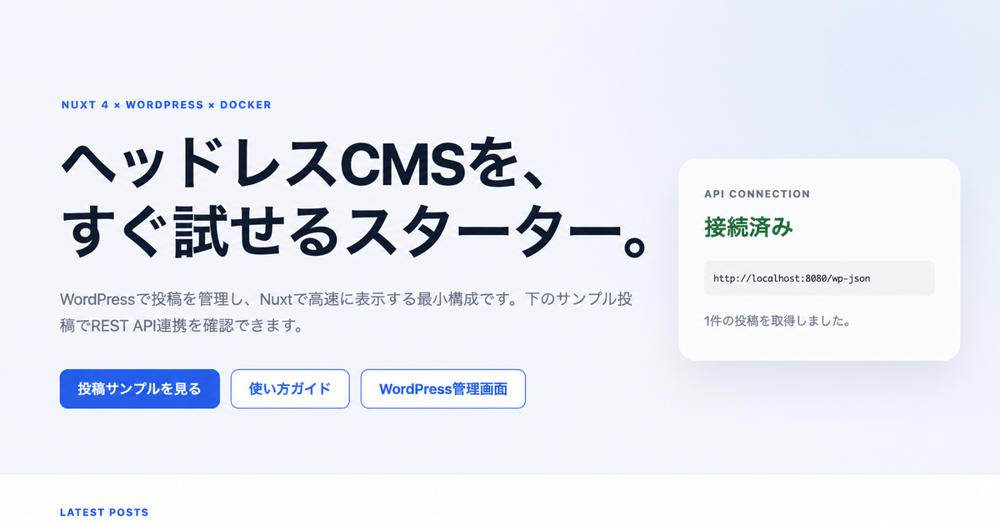

# 🚀 Nuxt ✕ WordPress Development Starter

**Language:** English | [日本語](#-日本語版)

> A production-ready starter template for integrating **Nuxt 4 (Frontend)** and **WordPress (CMS/API)** using Docker.


---

- [🖼 Screenshot](#-screenshot)
- [✨ Features](#-features)
- [🎯 What You Can Build](#-what-you-can-build)
- [👨‍💻 Who This Is For](#-who-this-is-for)
- [🛠 Prerequisites](#-prerequisites)
- [🚀 Quick Start](#-quick-start)
- [📁 Project Structure](#-project-structure)
- [⚙️ Configuration](#️-configuration)
- [🔗 How Integration Works](#-how-integration-works)
- [🛠 Development Workflow](#-development-workflow)
- [❓ FAQ & Troubleshooting](#-faq--troubleshooting)
- [🤝 Contributing](#-contributing)
- [🇯🇵 日本語版](#-日本語版)

---

## 🖼 Screenshot



---

## ✨ Features

- **Nuxt 4 frontend** ready for modern UI development
- **WordPress REST API backend** for content management
- **Docker-based local environment** for consistent setup
- **Headless CMS architecture** for flexible frontend implementation
- **Beginner-friendly documentation** for quick onboarding

---

## 🎯 What You Can Build

### 💡 Why Nuxt + WordPress?

- **WordPress** → Content management (posts, media, metadata) + REST API
- **Nuxt 4** → Modern frontend (SSR/SSG, fast, SEO-optimized)
- **Docker** → Consistent environment for teams and production deployment

### 🎯 Capabilities

✅ **Headless CMS Architecture**: Use WordPress as API server with beautiful Nuxt frontend  
✅ **Easy Content Management**: Manage posts and media through WordPress admin  
✅ **High Performance**: SSR/SSG capabilities for lightning-fast sites  
✅ **SEO Optimized**: Server-side rendering for search engine visibility  
✅ **Unified Development**: Docker ensures everyone works in the same environment  

### 🎨 Perfect For Building

- **Corporate Websites** - WordPress content management + Nuxt presentation
- **Blog Media Sites** - High-performance, SEO-friendly blogs
- **Portfolio Sites** - Showcase work managed in WordPress, beautifully displayed with Nuxt
- **E-commerce Content** - Product articles and content managed in WordPress

---

## 👨‍💻 Who This Is For

### ✅ Perfect For

- **Intermediate Developers** familiar with web development fundamentals
- **Frontend Developers** wanting to explore headless CMS architecture
- **WordPress Developers** interested in modern frontend approaches
- **Developers** seeking a production-ready Nuxt + WordPress setup

### 📚 You Should Have Experience With

- **Command Line** basics and terminal navigation
- **Git** version control fundamentals
- **REST APIs** and JSON data handling
- **Web Development** basics (HTML/CSS/JavaScript)
- **Either** WordPress administration **OR** modern JavaScript frameworks

### 🚀 New to These Technologies?

- **Docker**: [Docker Getting Started Guide](https://docs.docker.com/get-started/)
- **Nuxt 4**: [Nuxt Documentation](https://nuxt.com/docs/getting-started/introduction)
- **WordPress REST API**: [REST API Handbook](https://developer.wordpress.org/rest-api/)

---

## 🛠 Prerequisites

Please ensure you have the following tools installed:

### 💻 System Requirements

| Requirement | Minimum | Recommended |
|-------------|---------|-------------|
| **OS** | macOS 10.14+, Windows 10+, Ubuntu 18.04+ | Latest stable |
| **RAM** | 4GB available | 8GB+ |
| **Disk Space** | 5GB free | 10GB+ |
| **Internet** | Required for Docker images | Stable connection |

### 🔧 Required Tools

| Tool | Version | Purpose | Installation |
|------|---------|---------|--------------|
| **Docker Desktop** | v4.0+ | Container runtime | [Official Site](https://www.docker.com/products/docker-desktop/) |
| **Node.js** | v24 LTS | Nuxt development | [Official Site](https://nodejs.org/) |
| **npm** | v11+ (comes with Node.js) | Package management | Included with Node.js |
| **Git** | v2.30+ | Version control | [Official Site](https://git-scm.com/) |
> 💡 **Package Manager**: This project uses **npm inside Docker**.
> 
> - **npm**: The only supported package manager; use the committed `nuxt/package-lock.json`
>
> Version requirements are specified in `.nvmrc` (Node.js) and `package.json` (engines).
### 🎯 IDE & Extensions (Recommended)

| Tool/Extension | Purpose | Link |
|----------------|---------|------|
| **VS Code** | Main IDE | [Official Site](https://code.visualstudio.com/) |
| Docker Extension | Container management | [VS Code Marketplace](https://marketplace.visualstudio.com/items?itemName=ms-azuretools.vscode-docker) |
| Vue Language Features | Vue.js support | [VS Code Marketplace](https://marketplace.visualstudio.com/items?itemName=Vue.volar) |
| WordPress Snippets | WordPress development | [VS Code Marketplace](https://marketplace.visualstudio.com/items?itemName=wordpresstoolbox.wordpress-toolbox) |

### 🌐 Port Requirements

Make sure these ports are available:

- **3000**: Nuxt development server
- **8080**: WordPress site
- **3306**: MySQL database (internal)

> 💡 **Port Conflicts?** You can modify ports in `docker-compose.yml` if needed.

### ✅ Verification Commands

Run these to verify your setup:

```bash
# Check Docker
docker --version
docker compose version

# Check Node.js & package manager
node --version
npm --version

# Check Git
git --version

# Use Node.js version from .nvmrc (optional)
nvm use  # if you have nvm installed

# Verify available ports (optional)
lsof -i :3000  # Should return nothing
lsof -i :8080  # Should return nothing
```

---

## 🚀 Quick Start

### 1️⃣ Clone Repository

```bash
git clone https://github.com/hane-jp/nuxt-wordpress-docker.git
cd nuxt-wordpress-docker
```

### 2️⃣ Create Environment Configuration

```bash
cp .env.example .env
```

> 📝 **Note**: The `.env` file contains important settings like database passwords. This file is not tracked by Git for security reasons.

### 3️⃣ Start with Docker

```bash
docker compose up -d
```

> 💡 **Package Manager**: The container runs `npm ci` against the committed lockfile for reproducible installs.

### 4️⃣ Verify Setup

If you can access these URLs, you're successful:

| Service | URL | Purpose |
|---------|-----|---------|
| 🎨 **Nuxt Frontend** | http://localhost:3000 | User-facing site |
| ⚙️ **WordPress Admin** | http://localhost:8080/wp-admin | Content management |
| 🌐 **WordPress Site** | http://localhost:8080 | Default WordPress view |

### 5️⃣ WordPress Initial Setup

1. Go to [WordPress Admin](http://localhost:8080/wp-admin)
2. Follow the initial setup wizard
3. Create admin account

---

## 📁 Project Structure

```
./
├── 📄 docker-compose.yml    # Docker configuration
├── 📄 .env.example          # Environment variables template
├── 📄 .env                  # Environment variables (create this!)
│
├── 📂 nuxt/                 # Nuxt 4 frontend
│   ├── 📂 app/             # Nuxt 4 application directory
│   │   ├── 📄 app.vue      # Main app file
│   │   └── 📂 pages/       # Page files
│   ├── 📄 nuxt.config.ts   # Nuxt configuration
│   ├── 📄 package.json     # Nuxt dependencies
│   └── 📄 package-lock.json # Reproducible npm dependency lock
│
├── 📂 wp/                   # WordPress (auto-generated)
│   ├── 📄 wp-config.php    # WordPress configuration
│   └── ...                 # WordPress files
│
└── Docker volume: db-data   # MySQL data (auto-generated)
```

If you customize the frontend entry page, place it in `nuxt/app/pages/index.vue`.

> 💡 **Note**: `wp/` is created locally and `db-data` is a Docker named volume. Back up the database before upgrading an existing environment from MySQL 8.0 to 8.4. The Compose configuration temporarily enables `mysql_native_password` so existing 8.0 users can still connect; migrate those users to `caching_sha2_password` before removing that option.

---

## ⚙️ Configuration

### 🔧 .env File Settings

```env
# Database configuration
MYSQL_DATABASE=wpdb              # Database name
MYSQL_USER=wpuser               # Database user
MYSQL_PASSWORD=wppass           # Database password
MYSQL_ROOT_PASSWORD=rootpass    # Root password

# WordPress API endpoint
NUXT_PUBLIC_WP_API_BASE=http://localhost:8080/wp-json
```

> 🔒 **Security Warning**: Use strong passwords in production!

---

## 🔗 How Integration Works

### Included sample pages

| Route | Purpose |
|-------|---------|
| `/` | Starter guide, API connection status, and latest posts |
| `/guide` | Setup, publishing, customization, commands, and troubleshooting guide |
| `/guide/en` | English version of the user guide |
| `/posts` | WordPress post list with loading, empty, and error states |
| `/posts/[slug]` | Post detail with featured image and sanitized HTML content |

Nuxt proxies requests through its server API (`/api/posts`) to avoid browser CORS issues and to use the Docker-internal WordPress hostname during SSR. The UI remains usable before WordPress is initialized.
Both pretty REST URLs and WordPress's default plain-permalink REST URL are supported automatically.

### WordPress → Nuxt Data Retrieval

Uses WordPress **REST API** to fetch data:

```javascript
// Example: Fetching posts in Nuxt
const { data: posts } = await $fetch(`${config.public.wpApiBase}/wp/v2/posts`)
```

### Key API Endpoints

| Endpoint | Available Data |
|----------|---------------|
| `/wp/v2/posts` | Posts list & details |
| `/wp/v2/pages` | Static pages |
| `/wp/v2/media` | Images & attachments |
| `/wp/v2/categories` | Categories |
| `/wp/v2/tags` | Tags |

---

## 🛠 Development Workflow

### 📝 Daily Development Process

1. Create/edit content in **WordPress**
2. Implement design/features in **Nuxt**  
3. Review in browser
4. Commit code to Git when needed

### 🔄 Commonly Used Commands

```bash
# Start environment
docker compose up -d

# Stop environment  
docker compose down

# View logs
docker compose logs -f

# Restart only Nuxt
docker compose restart nuxt

# Install new packages locally only when needed
npm --prefix nuxt install <package>     # recommended local workflow

# Run unit tests
npm test
```

---

## ❓ FAQ & Troubleshooting

<details>
<summary>🚨 <strong>"Port 3000 is already in use" Error</strong></summary>

**Cause**: Another application is using the same port
**Solution**:
```bash
# Check what's using the port
lsof -i :3000

# Use different port in Docker Compose
# Change ports in docker-compose.yml to "3001:3000"
```
</details>

<details>
<summary>⚡ <strong>Nuxt Won't Start</strong></summary>

**Cause**: Node.js dependency issues
**Solution**:
```bash
# Recreate the dependency volume and start from the committed lockfile
docker compose down
docker volume rm nuxt-wordpress-docker_nuxt-node-modules
docker compose up -d
```
</details>

<details>
<summary>🗄️ <strong>WordPress Setup Screen Not Showing</strong></summary>

**Cause**: Database connection issues
**Solution**:
1. Check `.env` file settings
2. Complete Docker restart: `docker compose down && docker compose up -d`
</details>

<details>
<summary>🔄 <strong>Can't Fetch WordPress REST API</strong></summary>

**Solution**:
1. WordPress Admin → Settings → Permalinks → Save Changes
2. Check for plugin conflicts
3. Verify API URL: http://localhost:8080/wp-json 
</details>

### 🆘 Need More Help?

- Report issues via [Issues](../../issues)
- [WordPress REST API Documentation](https://developer.wordpress.org/rest-api/)
- [Nuxt 4 Documentation](https://nuxt.com/)

---

## 📋 Version History

### [v1.1.0] - 2026-08-28

- Updated Nuxt 3 to Nuxt 4.5 and adopted the `app/` directory structure
- Updated Node.js 20 to Node.js 24 LTS and MySQL 8.0 to MySQL 8.4 LTS
- Updated WordPress runtime to PHP 8.3
- Standardized package management on npm with reproducible `npm ci` installs

### [v1.0.0] - 2026-03-14 (Initial Release)

#### ✅ Features
- **Docker Compose** setup for Nuxt 4 + WordPress + MySQL
- **Production-ready** configuration with proper environment management
- **Docker-first development workflow** with npm-based container setup
- **Comprehensive documentation** with beginner-friendly setup guide
- **Security-first** approach with proper `.gitignore` and environment variables

#### 📦 Included
- Nuxt 3.12.0+ with TypeScript and Sass support
- WordPress with PHP 8.2 and Apache
- MySQL 8.0 database
- Docker development environment
- Version management (`.nvmrc`, `engines` in package.json)

#### 🎯 System Requirements
- Docker Desktop v4.0+
- Node.js v18+ (v20+ recommended)
- 4GB+ RAM, 5GB+ disk space

> 💡 **Future releases** will include additional features like production deployment guides, performance optimizations, and advanced WordPress/Nuxt integration examples.

---

## 🤝 Contributing

### Welcome Contributions

✅ **Bug fixes**  
✅ **Documentation improvements**  
✅ **Feature enhancements**  

### For Major Changes

🔄 Please **fork** this repository or use it as a **template**

---

<div align="center">

**🌟 Star this project if it helped you! 🌟**

Made with ❤️ for WordPress & Nuxt developers

</div>

---

# 🇯🇵 日本語版

## 🚀 Nuxt ✕ WordPress 開発環境スターター

> Docker を使って **Nuxt 4（フロントエンド）** と **WordPress（CMS/API）** を連携できる本番対応のスターターテンプレートです。

---

- [🖼 スクリーンショット](#-スクリーンショット)
- [✨ 特徴](#-特徴)
- [🎯 この構成でできること](#-この構成でできること)
- [👨‍💻 対象者](#-対象者)
- [🛠 必要な環境](#-必要な環境)
- [🚀 クイックスタート](#-クイックスタート)
- [📁 ディレクトリ構成](#-ディレクトリ構成)
- [⚙️ 設定について](#️-設定について) 
- [🔗 連携の仕組み](#-連携の仕組み)
- [🛠 開発フロー](#-開発フロー)
- [❓ よくある質問・トラブル](#-よくある質問トラブル)
- [🤝 コントリビュート](#-コントリビュート)

---

## 🖼 スクリーンショット


---

## ✨ 特徴

- **Nuxt 4 フロントエンド** ですぐにUI開発を始められます
- **WordPress REST API バックエンド** でコンテンツ管理ができます
- **Docker ベースのローカル環境** でセットアップ差異を減らせます
- **ヘッドレス CMS 構成** で柔軟にフロントエンドを実装できます
- **初学者にも追いやすいドキュメント** を用意しています

---

## 🎯 この構成でできること

### 💡 なぜ Nuxt + WordPress なの？

- **WordPress** → コンテンツ管理（記事・画像・メタデータ）+ REST API
- **Nuxt 4** → モダンなフロントエンド（SSR/SSG、高速、SEO最適化）
- **Docker** → 環境を統一し、チーム開発や本番移行を簡単に

### 🎯 できること

✅ **ヘッドレス CMS 構成**：WordPressをAPIサーバーとして使い、Nuxt で美しいフロントエンドを構築  
✅ **コンテンツ管理が簡単**：WordPress管理画面で記事や画像を管理  
✅ **高速なサイト**：Nuxt のSSR/SSG機能でパフォーマンス向上  
✅ **SEO最適化**：サーバーサイドレンダリングで検索エンジン対応  
✅ **開発環境統一**：Dockerでチーム全員が同じ環境で開発  

### 🎨 こんなものが作れます

- **企業サイト** - WordPressで記事管理、Nuxtで表示
- **ブログメディア** - 高速でSEOに強いブログ
- **ポートフォリオサイト** - 作品をWordPressで管理、Nuxtで美しく表示
- **ECサイトのメディア部分** - 商品紹介記事をWordPressで管理

---

## 👨‍💻 対象者

### ✅ 適している方

- **中級レベルの開発者** でWeb開発の基礎知識をお持ちの方
- **フロントエンドエンジニア** でヘッドレスCMS構成を学びたい方
- **WordPressエンジニア** でモダンなフロントエンド連携に興味のある方
- **本番対応**のNuxt + WordPress環境を求めている方

### 📚 必要な前提知識

- **コマンドライン** の基本操作とターミナル操作
- **Git** のバージョン管理基礎
- **REST API** とJSON データの取り扱い
- **Web開発** の基礎知識（HTML/CSS/JavaScript）
- **WordPress管理** または **モダンJavaScriptフレームワーク** のいずれかの経験

### 🚀 これらの技術が初めての場合

- **Docker**: [Docker入門ガイド](https://docs.docker.com/get-started/)
- **Nuxt 4**: [Nuxt公式ドキュメント](https://nuxt.com/docs/getting-started/introduction)
- **WordPress REST API**: [REST APIハンドブック](https://developer.wordpress.org/rest-api/)

---

## 🛠 必要な環境

以下のツールをインストールしてください：

### 💻 システム要件

| 要件 | 最小要件 | 推奨 |
|------|----------|------|
| **OS** | macOS 10.14+, Windows 10+, Ubuntu 18.04+ | 最新の安定版 |
| **メモリ** | 4GB 利用可能 | 8GB以上 |
| **ディスク容量** | 5GB の空き | 10GB以上 |
| **インターネット** | Dockerイメージ用に必要 | 安定した接続 |

### 🔧 必須ツール

| ツール | バージョン | 用途 | インストール |
|--------|------------|------|--------------|
| **Docker Desktop** | v4.0以上 | コンテナ実行環境 | [公式サイト](https://www.docker.com/products/docker-desktop/) |
| **Node.js** | v24 LTS | Nuxt開発環境 | [公式サイト](https://nodejs.org/) |
| **npm** | v11以上（Node.jsに含まれる） | パッケージ管理 | Node.jsに含まれる |
| **Git** | v2.30以上 | バージョン管理 | [公式サイト](https://git-scm.com/) |
> 💡 **パッケージマネージャー**: このプロジェクトは **Docker 内で npm を使用** します。
> 
> - **npm**: 唯一の対応パッケージマネージャー。コミット済みの `nuxt/package-lock.json` を使用
>
> バージョン要件は `.nvmrc` (Node.js) と `package.json` (engines) に指定されています。
### 🎯 IDE・拡張機能（推奨）

| ツール・拡張機能 | 用途 | リンク |
|------------------|------|------|
| **VS Code** | メインIDE | [公式サイト](https://code.visualstudio.com/) |
| Docker 拡張機能 | コンテナ管理 | [VS Code Marketplace](https://marketplace.visualstudio.com/items?itemName=ms-azuretools.vscode-docker) |
| Vue Language Features | Vue.js サポート | [VS Code Marketplace](https://marketplace.visualstudio.com/items?itemName=Vue.volar) |
| WordPress Snippets | WordPress開発 | [VS Code Marketplace](https://marketplace.visualstudio.com/items?itemName=wordpresstoolbox.wordpress-toolbox) |

### 🌐 ポート要件

以下のポートが利用可能であることを確認してください：

- **3000**: Nuxt開発サーバー
- **8080**: WordPressサイト
- **3306**: MySQLデータベース（内部）

> 💡 **ポート競合？** 必要に応じて `docker-compose.yml` でポートを変更できます。

### ✅ 環境確認コマンド

セットアップを確認するために以下を実行してください：

```bash
# Docker確認
docker --version
docker compose version

# Node.js & パッケージマネージャー確認
node --version
npm --version

# Git確認
git --version

# .nvmrcのNode.jsバージョンを使用（オプション）
nvm use  # nvmがインストールされている場合

# ポート利用状況確認（オプション）
lsof -i :3000  # 何も返されなければOK
lsof -i :8080  # 何も返されなければOK
```

---

## 🚀 クイックスタート

### 1️⃣ リポジトリをクローン

```bash
git clone https://github.com/hane-jp/nuxt-wordpress-docker.git
cd nuxt-wordpress-docker
```

### 2️⃣ 環境設定ファイルを作成

```bash
cp .env.example .env
```

> 📝 **補足**：`.env`ファイルにはデータベースのパスワードなど重要な設定が入ります。このファイルは Git に含まれません（セキュリティのため）。

### 3️⃣ Docker で環境を起動

```bash
docker compose up -d
```

> 💡 **パッケージマネージャー**: コンテナはコミット済みロックファイルに対して `npm ci` を実行します。

### 4️⃣ 起動確認

以下のURLにアクセスできれば成功です：

| サービス | URL | 用途 |
|----------|-----|------|
| 🎨 **Nuxt フロント** | http://localhost:3000 | ユーザーが見る画面 |
| ⚙️ **WordPress 管理画面** | http://localhost:8080/wp-admin | コンテンツ管理 |
| 🌐 **WordPress サイト** | http://localhost:8080 | WordPress標準画面 |

### 5️⃣ WordPress 初期設定

1. [WordPress管理画面](http://localhost:8080/wp-admin) にアクセス
2. 初期設定ウィザードに従ってサイトを設定
3. 管理者アカウントを作成

---

## 📁 ディレクトリ構成

```
./
├── 📄 docker-compose.yml    # Docker構成定義
├── 📄 .env.example          # 環境変数のサンプル
├── 📄 .env                  # 環境変数（作成してね！）
│
├── 📂 nuxt/                 # Nuxt 4 フロントエンド
│   ├── 📂 app/             # Nuxt 4 アプリケーションディレクトリ
│   │   ├── 📄 app.vue      # メインアプリファイル
│   │   └── 📂 pages/       # ページファイル
│   ├── 📄 nuxt.config.ts   # Nuxt設定
│   ├── 📄 package.json     # Nuxt依存関係
│   └── 📄 package-lock.json # npm依存関係の固定ファイル
│
├── 📂 wp/                   # WordPress （自動生成）
│   ├── 📄 wp-config.php    # WordPress設定
│   └── ...                 # WordPressのファイル群
│
└── Docker volume: db-data   # MySQL データ（自動生成）
```

フロントのトップページをカスタマイズする場合は `nuxt/app/pages/index.vue` に配置してください。

> 💡 **ポイント**：`wp/` はローカルに作成され、`db-data` は Docker の名前付きボリュームです。既存環境を MySQL 8.0 から 8.4 へ更新する前に、必ずデータベースをバックアップしてください。Compose では既存の 8.0 ユーザーが接続できるよう `mysql_native_password` を一時的に有効化しています。ユーザーを `caching_sha2_password` へ移行してから、このオプションを削除してください。

---

## ⚙️ 設定について

### 🔧 .env ファイル設定

```env
# データベース設定
MYSQL_DATABASE=wpdb              # データベース名
MYSQL_USER=wpuser               # データベースユーザー
MYSQL_PASSWORD=wppass           # データベースパスワード
MYSQL_ROOT_PASSWORD=rootpass    # root パスワード

# WordPress API エンドポイント
NUXT_PUBLIC_WP_API_BASE=http://localhost:8080/wp-json
```

> 🔒 **セキュリティ注意**：本番環境では必ず強固なパスワードに変更してください！

---

## 🔗 連携の仕組み

### サンプルページ

| ルート | 内容 |
|--------|------|
| `/` | セットアップ案内、API接続状態、最新投稿 |
| `/guide` | セットアップ、投稿、カスタマイズ、コマンド、トラブル対応のガイド |
| `/guide/en` | 使い方ガイドの英語版 |
| `/posts` | ローディング・0件・エラー状態を備えた投稿一覧 |
| `/posts/[slug]` | アイキャッチ画像とサニタイズ済み本文を表示する投稿詳細 |

NuxtサーバーのAPI（`/api/posts`）を経由することで、ブラウザのCORS問題を避け、SSR時にはDocker内部のWordPressホスト名を利用します。WordPressの初期設定前でも画面は安全に表示されます。
通常のREST URLと、WordPressの初期パーマリンク状態で使われるクエリ形式のREST URLの両方へ自動対応します。

### WordPress → Nuxt へのデータ取得

WordPressの**REST API**を使ってデータを取得します：

```javascript
// Nuxtでの記事取得例
const { data: posts } = await $fetch(`${config.public.wpApiBase}/wp/v2/posts`)
```

### 主要なAPIエンドポイント

| エンドポイント | 取得できるデータ |
|---------------|-----------------|
| `/wp/v2/posts` | 投稿一覧・詳細 |
| `/wp/v2/pages` | 固定ページ |
| `/wp/v2/media` | 画像・添付ファイル |
| `/wp/v2/categories` | カテゴリー |
| `/wp/v2/tags` | タグ |

---

## 🛠 開発フロー

### 📝 日常の開発手順

1. **WordPress** で記事・ページを作成・編集
2. **Nuxt** でフロントエンドのデザイン・機能を実装  
3. ブラウザで確認・調整
4. 必要に応じてGit でコード保存

### 🔄 よく使うコマンド

```bash
# 環境起動
docker compose up -d

# 環境停止  
docker compose down

# ログ確認
docker compose logs -f

# Nuxtのみ再起動
docker compose restart nuxt

# 新しいパッケージのインストール（ローカルで必要な場合のみ）
npm --prefix nuxt install <パッケージ名>     # 推奨のローカル運用

# ユニットテスト
npm test
```

---

## ❓ よくある質問・トラブル

<details>
<summary>🚨 <strong>「ポート 3000 は既に使用されています」エラー</strong></summary>

**原因**：他のアプリが同じポートを使用
**解決法**：
```bash
# 使用中のプロセスを確認
lsof -i :3000

# Docker Compose で別のポートを使用
# docker-compose.yml の ports を "3001:3000" に変更
```
</details>

<details>
<summary>⚡ <strong>Nuxt が起動しない</strong></summary>

**原因**：Node.jsの依存関係の問題
**解決法**：
```bash
# 依存関係ボリュームを作り直し、コミット済みロックファイルから起動
docker compose down
docker volume rm nuxt-wordpress-docker_nuxt-node-modules
docker compose up -d
```
</details>

<details>
<summary>🗄️ <strong>WordPressの初期設定画面が表示されない</strong></summary>

**原因**：データベース接続の問題
**解決法**：
1. `.env` ファイルの設定を確認
2. Docker を完全再起動：`docker compose down && docker compose up -d`
</details>

<details>
<summary>🔄 <strong>WordPress の REST API が取得できない</strong></summary>

**解決法**：
1. WordPress管理画面 → 設定 → パーマリンク設定 → 変更を保存
2. プラグイン競合の確認
3. API URL の確認：http://localhost:8080/wp-json 
</details>

### 🆘 さらにサポートが必要な場合

- [Issues](../../issues) で質問・バグ報告
- [WordPress REST API 公式ドキュメント](https://developer.wordpress.org/rest-api/)
- [Nuxt 4 公式ドキュメント](https://nuxt.com/)

---

## 📋 バージョン履歴

### [v1.1.0] - 2026-08-28

- Nuxt 3 から Nuxt 4.5 へ更新し、`app/` ディレクトリ構成へ移行
- Node.js 20 から Node.js 24 LTS、MySQL 8.0 から MySQL 8.4 LTS へ更新
- WordPress 実行環境を PHP 8.3 へ更新
- npm に統一し、`npm ci` による再現可能なインストールへ変更

### [v1.0.0] - 2026-03-14 (初期リリース)

#### ✅ 機能
- **Docker Compose** による Nuxt 4 + WordPress + MySQL 環境構築
- **本番対応** の適切な環境変数管理
- **Dockerファーストの開発フロー** と npm ベースのコンテナ構成
- **包括的なドキュメント** と詳細なセットアップガイド
- **セキュリティ重視** の `.gitignore` と環境変数設定

#### 📦 含まれるもの
- Nuxt 3.12.0+ with TypeScript と Sass サポート
- WordPress with PHP 8.2 と Apache
- MySQL 8.0 データベース
- Docker 開発環境
- バージョン管理（`.nvmrc`、package.json の engines）

#### 🎯 システム要件
- Docker Desktop v4.0+
- Node.js v18+（v20+ 推奨）
- 4GB+ メモリ、5GB+ ディスク容量

> 💡 **今後のリリース** では、本番デプロイガイド、パフォーマンス最適化、WordPress/Nuxt 高度連携例などを追加予定です。

---

## 🤝 コントリビュート

### 歓迎する貢献

✅ **バグ修正**  
✅ **ドキュメント改善**  
✅ **機能追加・改善**  

### 大きな変更をしたい場合

🔄 このリポジトリを**フォーク**するか、**テンプレート**として使用してください

---

<div align="center">

**🌟 このプロジェクトが役に立ったら Star をお願いします！🌟**

Made with ❤️ for WordPress & Nuxt developers

</div>
